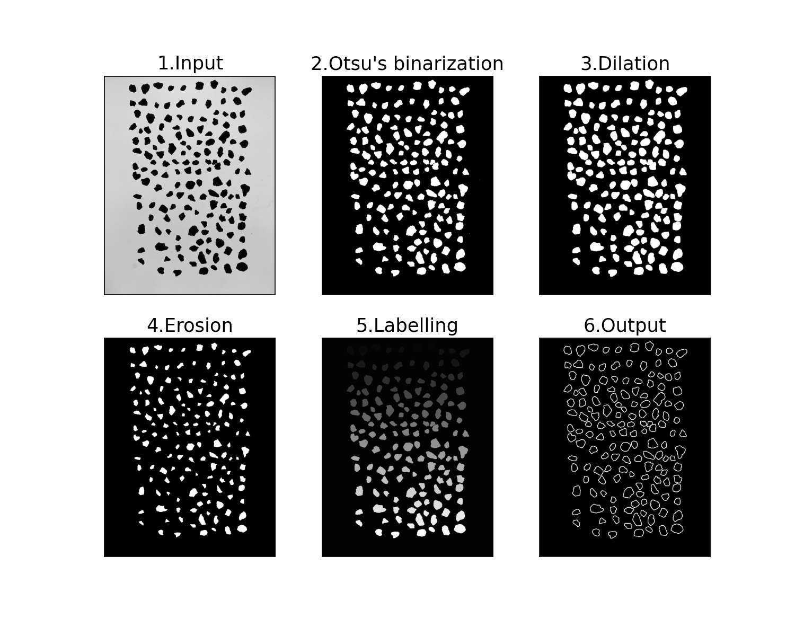
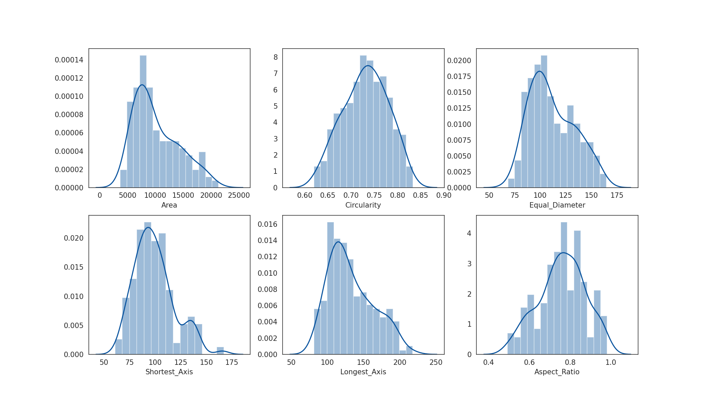

# openCV

The script to detect contour of objects using watershed algorithm in `openCV`

## Table of Contents
* [DEMO](#demo)
* [Requirements](#requirements)

## DEMO
### find contours

### calculate parameters

## Requirements
* python 3.7
* openCV 4.2.0
